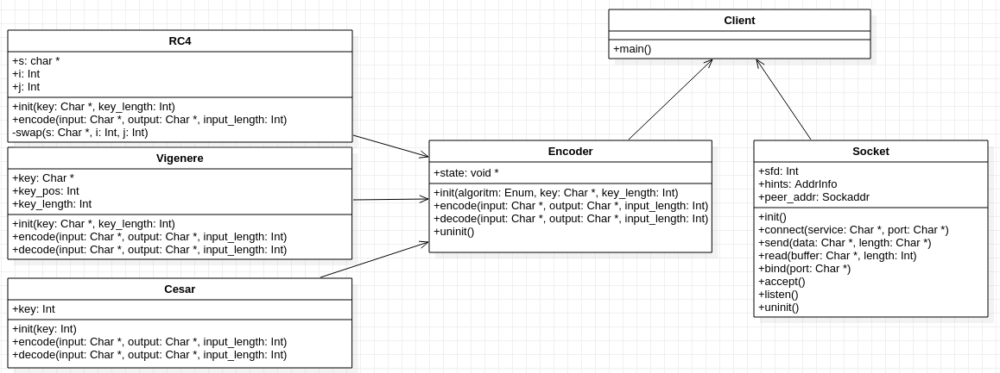

# TP1 - Crypto-Sockets

Pablo Salvador Dimartino - 101231

Taller de Programación I (75.42) - 2º Cuatrimestre 2020

Facultad de Ingeniería

Universidad de Buenos Aires

[Link al repositorio de GitHub](https://github.com/psdimartino/TallerDeProgramacionTP1)

## Introduccion

Para la resolución del problema se intentó emular clases en código c. De esta forma se pueden crear pequeños modulos mas facilmente testeables y se mejora su entendimiento y calidad.

## Estructura del código

Por un lado se tiene una clase `Encoder` que como atributo contiene a un codificador/decodificador en particular. Esto se realiza guardando el `struct` de estado y los punteros a las funciones de codificación y decodificación de alguno de los decodificadores: Cesar, Vigenere y Rivest Cipher 4.

Al llamar a un "método" de la clase `Encoder`, esta delega el comportamiento en su estado. De esta manera se puede modificar el comportamiento de dicha clase en tiempo de ejecución.

Una representación de esto se puede realizar a travez de un modelo similar a un diagrama de clases UML:

## Sockets

### Manejo de la perdida de paquetes

Para poder evitar los problemas de *packet loss* entre la conexíon de cliente y servidor se realiza un ciclo que termia al recibirse la información correspondiente al tamaño de un buffer o se pierda la comunación con el socket.

### *Shutdown* del socket

El *socket* del lado del servidor asume que cuando la función `recv()` retorna 0 el socket cerró la conexión y se terminó el envio de paquetes.

## Codificadores

Los codificadores guardan cada uno su estado en un `struct` particular. Estos son recibidos como parámetro al realizar las operaciones correspondientes. Cada TDA se responsabiliza de iniciar correctamente su estado.

## Supresión de las advertencias del compilador

Se decidó suprimir las advertencias del compilador del tipo *unusedStructMember*. Esto se debe a que dichos elementos de las estructuras si son utilizadas. Las declaraciones de la funcion necesitan obtener el parámetro de estado en forma de puntero genérico, pero es necesario incluir los `structs` en el *header* de cada codificador para la correcta utilización del mismo.

